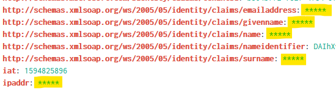

# Azure Activity Logs to Splunk

This directory contains a sample event bridge for routing Activity Logs from an Azure subscription to a Splunk
installation (Enterprise or Cloud).

It comes in 2 flavours:

* **azureactivitylogs-splunk**

    An instance of the Azure Activity Logs event source sends events to a central event broker. A Splunk event target
    subscribes to all events from that event broker and sends them to Splunk.

    ```
    +--------+       +--------+       +--------+
    | source |-------> broker <- - - -| target |
    +--------+       +--------+       +--------+
    ```

* **azureactivitylogs-splunk-anonymize**

    Instead of subscribing directly to the events generated by the Azure Activity Logs event source, the Splunk event
    target subscribes to events from a _second_ event broker. The latter contains an anonymized copy of every Azure
    Activity Log generated by the event source. An intermediate data anonymization service is responsible for moving
    events from one broker to the other.

    ```
    +--------+       +--------+       +---------+
    | source |-------> broker <- - - -| transf. |
    +--------+       +--------+       +---------+
                                           |
                           +---------------+
                           |
                     +-----v--+       +--------+
                     | broker <- - - -| target |
                     +--------+       +--------+
    ```


    

Please refer to the [TriggerMesh documentation][tm-doc] for more information about configuring the aforementioned event
sources and targets.

[tm-doc]: https://docs.triggermesh.io/
